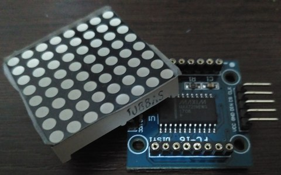
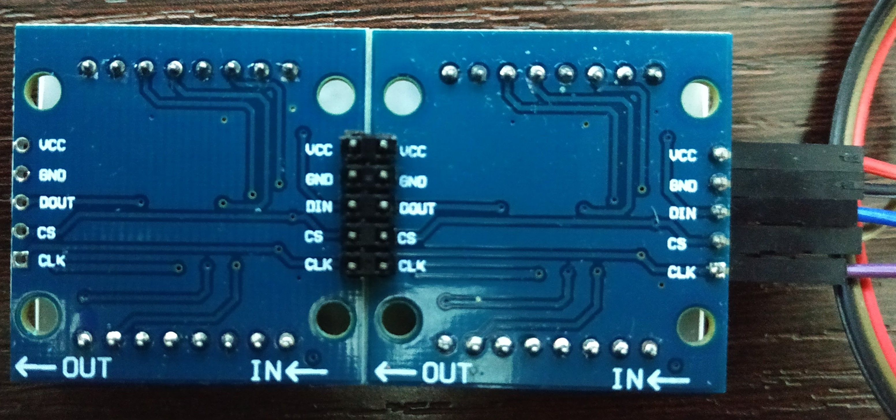
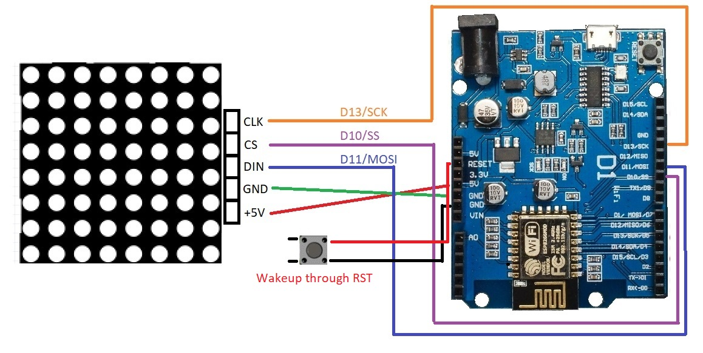
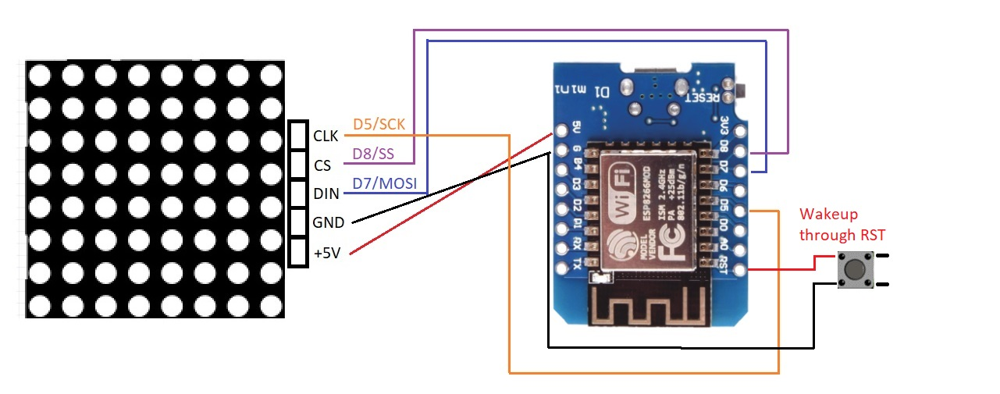
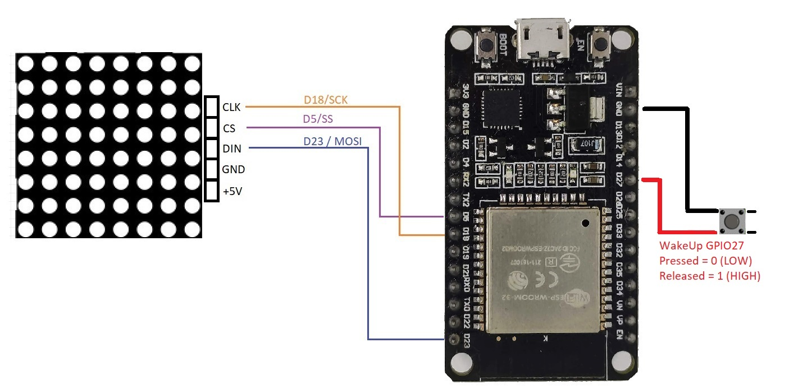
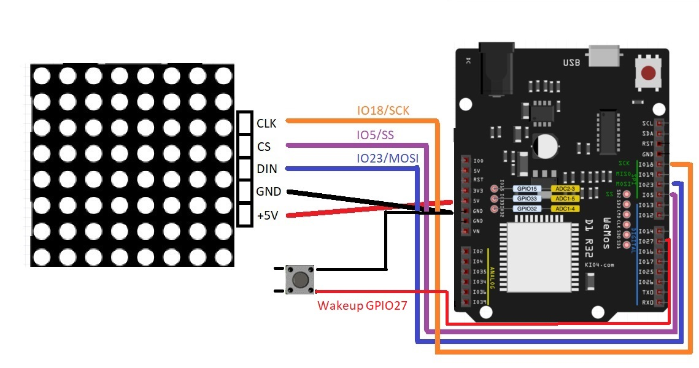

# Arduino-Espressif-MatrixLED
Software for Espressif8266/ESP32 MCUs to control 8x8 dot matrix LED based on MAX7219 ICs in FC-16 boards with led matrix model 1088AS




## Features
- Configurable matrix size by attaching multiple LED Matrixes
- Configurable marquees and animations to display
- Interactive games using joystick: Snake and Tetris

### Hardware components used for Led Cube

- ESP8266-based Wemos [D1 R1](https://www.prometec.net/wemos-d1-esp8266-wifi/)/[D1 Mini](https://www.wemos.cc/en/latest/d1/d1_mini_lite.html) or compatible
- ESP32-based Wemos [D1 R32](https://docs.platformio.org/en/latest/boards/espressif32/wemos_d1_uno32.html)/[DevKit V1](https://docs.platformio.org/en/latest/boards/espressif32/esp32doit-devkit-v1.html) or compatible
- 8x8 dot matrix LEDs model 1088AS with MAX7219 in [FC-16](https://majicdesigns.github.io/MD_MAX72XX/page_f_c16.html) boards
- Battery or USB powerbank [ 5V, +2000 mAh ]
- Joystick analog 2-Axis with button for interaction with games or PC/Cellphone with web browser

### Software structure

The software is splitted into [Abstraction Layers](https://en.wikipedia.org/wiki/Abstraction_layer) so the responsability of each layer are very limited and will make easier the growth and maintenance of the project in a Architectural point of view. Using a objected-oriented language such as C++ accepted by Arduino, makes the implementation closer to this approach.

**Dependencies**: Needs to have access to _Arduino-Generic-Libraries/lib_ in this same repository
```
Arduino-Matrix-LED
|--lib
|  |--LM_Game
|  |  |- CLedGame_Tetris.cpp
|  |  |- CLedGame_Snake.cpp
|  |  |- CLedGame.cpp
|  |  |- CLedGame.h
|  |  |- CLedGameController.h
|  |--LM_Marquee
|  |  |- CLedMarquee.cpp
|  |  |- CLedMarquee.h
|  |  |- CLedEyes.cpp
|  |  |- CLedEyes.h
|  |--LM_WeatherStation
|  |  |- CLedWeather.cpp
|  |  |- CLedWeather.h
|  |--Webserver
|  |  |- CWebserver.cpp
|  |  |- CWebserver.h
|--src
|  |- main.cpp
|  |- main.h
|- platformio.ini
Arduino-Generic-Libraries
|--lib
|  |--Common_Lib
|  |--Joystick_Lib
|--external-libs
|  |--MD_MAX72XX
|  |--LinkedList
```

### Build schematics
| **Compatible board** | **Schematics** |
| ----------- | ------------------- |
| Wemos D1 [ESP8266] |  |
| Wemos D1 Mini [ESP8266] |  |
| Wemos DevKit V1 [ESP32] |  |
| Wemos D1 R32 [ESP32] |  |
